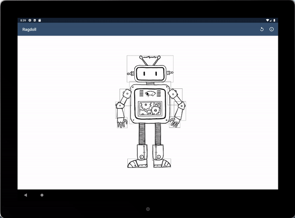

# RagdollDemo

CS349 Spring2019 A4: Direct Manipulation & Scene Graphs (Java/Android) -- Ragdoll
https://www.student.cs.uwaterloo.ca/~cs349/s19/assignments/a4.html

The repository only shows the demo UI. The source code is set private to prevent plagiarism, please contact me if you want to see the code. :)

### /******************** Usage for Toolbar ********************/

##### Toolbar 
  | 
  ----- Reset: return the doll to its starting size, and position. 
  | 
  ----- About: Display a popup with the application name, programmer name and student number. 
   

### /******************** Main activity UI ********************/

##### Body Part 
  | 
  ----- Torso: the only body part that can be translated. Touching and dragging the torso should move the entire paper doll. The torso cannot be rotated. 
  | 
  ----- Head: can be rotated around their contact point. The head can tilt left and right relative to the torso (within 50 degrees). 
  | 
  ----- Upper Arm: can be rotated around their contact point. The upper arm is attached to the torso and may rotate an entire 360 degrees about its point of attachment to the torso. When rotating the upper arm, the lower arm retains its same relative orientation to the upper arm. 
  | 
  ----- Lower Arm: can be rotated around their contact point. The lower arms have a movement range of 135 degrees in either direction relative to the primary axis defined by the upper arm. 
  | 
  ----- Hand: can be rotated around their contact point. The hand can pivot 35 degrees in either direction relative to the lower arm. It maintains its same relative orientation to the lower arm independent of any rotations of the lower or upper arm. 
  | 
  ----- Upper Leg: can be rotated around their contact point. The upper leg can pivot 90 degrees in either direction relative to the primary axis defined by the torso. The upper leg can be "stretched" by scaling them along their primary axes. Furthermore, scaling the upper leg scales the corresponding lower leg simultaneously. 
  | 
  ----- Lower Leg: can be rotated around their contact point. The lower leg can also pivot 90 degrees in either direction relative to primary axis defined by the upper leg. The lower leg can be "stretched" by scaling them along their primary axes. Furthermore, scaling the upper leg scales the corresponding lower leg simultaneously. 
  | 
  ----- Foot: can be rotated around their contact point. The foot can pivot 35 degrees in either direction from this initial orientation (90 degree angle to the lower leg). 
   

(Attention for pointing: every body component is rounded by a rectangle. When a pointer fall into the rectangle (not only the image), it means the corresponding body component is selected.

(Attention for scaling: Which part to choose is based on the coordinates of the two fingers. Two fingers need to touch the part to scale it.

### /******************** Creativity ********************/

Locate / draw images for a head, torso, upper and lower arm, hands, upper and lower leg, and feet and has received the prof's agreement on the content.

### /******************** Others ********************/

Phone: Pixel C (Google tablet) AVD using API 28, in Landscape orientation.

Android SDK: API 28.

### /******************** Demo gif ********************/

